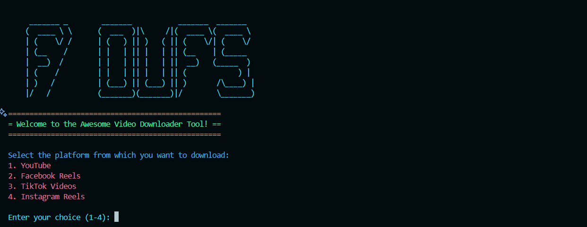

---

# Awesome Video Downloader Tool



A terminal-based Python script to download videos from YouTube, Facebook Reels, TikTok, and Instagram Reels with customizable quality options (for YouTube) and an awesome UI.

## Table of Contents

- [Features](#features)
- [Requirements](#requirements)
- [Installation](#installation)
- [Usage](#usage)
- [How It Works](#how-it-works)
- [Contributing](#contributing)
- [License](#license)

---

## Features

- **Cross-Platform**: Works on Windows, macOS, and Linux.
- **Quality Selection**: Choose the desired video quality for YouTube downloads (best, 720p, 480p, etc.).
- **Multi-Platform Support**: Download videos from YouTube, Facebook Reels, TikTok, and Instagram Reels.
- **Progress Tracking**: Real-time progress bar for downloads.
- **Customizable Download Folder**: Specify a custom folder or use the default "Downloads" folder.
- **Error Handling**: Graceful error handling with informative messages.
- **Awesome UI**: Colorful and interactive terminal interface with ASCII art and animations.

---

## Requirements

Before using this tool, ensure you have the following installed:

- **Python 3.7+**
- Required libraries:
  - `yt-dlp`
  - `tqdm`
  - `requests`
  - `colorama`

You can install the required libraries using pip:

```bash
pip install yt-dlp tqdm requests colorama
```

> **Note**: This tool does not require `ffmpeg`, as it downloads videos in a single file format.

---

## Installation

1. Clone the repository:

   ```bash
   git clone https://github.com/NatroyX/awesome-video-downloader.git
   cd awesome-video-downloader
   ```

2. Install the dependencies:

   ```bash
   pip install -r requirements.txt
   ```

3. Run the script:

   ```bash
   python downloader.py
   ```

---

## Usage

### Step-by-Step Guide

1. **Launch the Tool**:
   Run the script in your terminal:

   ```bash
   python downloader.py
   ```

2. **Select Platform**:
   Choose the platform from which you want to download the video:
   - `1`: YouTube
   - `2`: Facebook Reels
   - `3`: TikTok Videos
   - `4`: Instagram Reels

3. **Enter Video URL**:
   Input the URL of the video you want to download.

4. **Choose Quality (YouTube Only)**:
   If you selected YouTube, choose the desired video quality:
   - `1`: Best quality
   - `2`: 720p
   - `3`: 480p
   - `4`: 360p
   - `5`: 240p
   - `6`: 144p

5. **Set Download Folder**:
   - Use the default "Downloads" folder or specify a custom folder.
   - If the specified folder doesn't exist, the tool will create it for you.

6. **Start Download**:
   The tool will begin downloading the video and display a progress bar.

7. **Completion**:
   Once the download is complete, a success message will be displayed.

---

## How It Works

- **YouTube Downloads**:
  - Uses `yt-dlp` to download videos with customizable quality.
  - Downloads the video and audio as a single MP4 file without requiring `ffmpeg`.

- **Other Platforms**:
  - Downloads videos directly from the provided URL.
  - Supports Facebook Reels, TikTok, and Instagram Reels.

- **Progress Bar**:
  - Displays real-time download progress using the `tqdm` library.

- **UI Enhancements**:
  - Includes colorful output, ASCII art, and loading animations for a better user experience.

---

## Contributing

 Contributions are welcome! If you'd like to contribute, please follow these steps:

1. Fork the repository.
2. Create a new branch: `git checkout -b feature/new-feature`.
3. Make your changes and commit them: `git commit -m "Add new feature"`.
4. Push to the branch: `git push origin feature/new-feature`.
5. Submit a pull request explaining your changes.

---

## License

This project is licensed under the [MIT License](LICENSE). Feel free to use, modify, and distribute the code as per the terms of the license.

---

## Example Output

### For YouTube:

```
 ________________________________________________________________ 
Downloading YouTube video...
Select video quality:
1. best
2. 720p
3. 480p
4. 360p
5. 240p
6. 144p
Enter your choice (1-6): 2

Downloading from YouTube...
Downloading: Example Video - 50.23%
Download completed!
 ________________________________________________________________ 
```

### For TikTok:

```
 ________________________________________________________________ 
Downloading TikTok_Video video...                                
 ----------------------------------------------------------------
Downloading TikTok_Video               |███████████████████████████| 5.2M/5.2M [00:05<00:00, 1.04MB/s]
 ----------------------------------------------------------------
 Download completed!                                             
 ________________________________________________________________ 
```

---

## Contact

If you encounter any issues or have suggestions, feel free to open an issue on the [GitHub repository](https://github.com/NatroyX/awesome-video-downloader).

**Author**: NatroyX  
**Email**: xnatroy@gmail.com

---

Feel free to customize the placeholders (e.g., email, repository URL) with your actual information before publishing the project on GitHub.